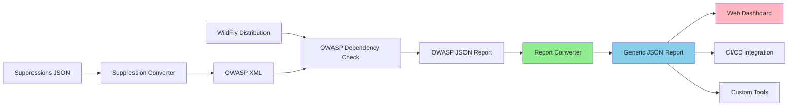

# WildFly SCA Scanner

[](https://opensource.org/licenses/Apache-2.0)
[](https://openjdk.org/)
[](https://maven.apache.org/)

A comprehensive security scanning solution for WildFly application server, providing automated vulnerability detection, reporting, and suppression management.

## 🎯 Overview

The WildFly SCA (Software Composition Analysis) Scanner is a suite of tools designed to:

- **Scan WildFly distributions** for known security vulnerabilities using OWASP Dependency Check
- **Convert reports** to a tool-agnostic generic JSON format for easy consumption
- **Manage suppressions** with version-specific filtering capabilities
- **Provide transparency** through a public CVE dashboard for the community

This project runs nightly scans on multiple WildFly versions and makes the results publicly available, helping the community stay informed about security issues.

## 📦 Components

### 1. Java Utilities

Located in [`java-utilities/`](java-utilities/), this contains two Maven modules:

#### Report Converter
Converts OWASP Dependency Check JSON reports to a standardized generic format.

```bash
java -jar report-converter.jar \
  --input dependency-check-report.json \
  --output wildfly-39.0.1.Final-cve-report.json \
  --version 39.0.1.Final
```

**Features:**
- Tool-agnostic output format
- CVSS v2, v3, and v4 support
- Suppression tracking
- Summary statistics
- Optional filtering of suppressed CVEs

[📖 Full Documentation](java-utilities/README.md) | [🧪 Test Coverage](java-utilities/report-converter/TEST_COVERAGE.md)

#### Suppression Converter *(Coming Soon)*
Bidirectional converter between JSON and OWASP XML suppression formats with version filtering.

### 2. Schemas

Located in [`schemas/`](schemas/), contains JSON Schema definitions:

- **generic-report-schema.json** - Defines the standardized CVE report format
- **suppression-schema.json** *(Coming Soon)* - Defines the suppression format

[📖 Schema Documentation](schemas/SCHEMA_DOCUMENTATION.md)

### 3. Web Dashboard *(Coming Soon)*

A public-facing web interface to view CVE status for different WildFly versions.

### 4. GitHub Actions Workflows

Located in [`.github/workflows/`](.github/workflows/), automates:
- Nightly security scans
- Report generation
- Dashboard updates

[📖 Integration Guide](GITHUB_ACTIONS_INTEGRATION.md)

## 🚀 Quick Start

### Prerequisites

- **Java 25** or higher
- **Maven 3.9** or higher
- **Git** for cloning the repository

### Build Everything

```bash
# Clone the repository
git clone https://github.com/wildfly-security/wildfly-sca-scanner.git
cd wildfly-sca-scanner

# Build all Java utilities
cd java-utilities
mvn clean install

# The executable JARs are now in:
# - report-converter/target/report-converter.jar
# - suppression-converter/target/suppression-converter.jar
```

### Convert Your First Report

```bash
# Run OWASP Dependency Check (example)
dependency-check --project "WildFly" \
  --scan /path/to/wildfly \
  --format JSON \
  --out dependency-check-report.json

# Convert to generic format
java -jar java-utilities/report-converter/target/report-converter.jar \
  --input dependency-check-report.json \
  --output wildfly-cve-report.json \
  --version 39.0.1.Final

# View the results
cat wildfly-cve-report.json | jq .summary
```

[📖 Detailed Quick Start Guide](QUICK_START.md)

## 📊 Project Status

**Current Phase:** Report Converter - Complete ✅

| Component | Status | Coverage |
|-----------|--------|----------|
| Report Converter | ✅ Complete | 40 tests, all passing |
| Suppression Converter | 🚧 Planned | - |
| Web Dashboard | 🚧 Planned | - |
| GitHub Actions Integration | ✅ Active | Nightly scans running |

## 📚 Documentation

### Getting Started
- [Quick Start Guide](QUICK_START.md) - Get up and running in 5 minutes
- [Java Utilities README](java-utilities/README.md) - Detailed module documentation
- [Contributing Guide](CONTRIBUTING.md) - How to contribute to the project

### Technical Documentation
- [Schema Documentation](schemas/SCHEMA_DOCUMENTATION.md) - Understanding the report format
- [Test Coverage Report](java-utilities/report-converter/TEST_COVERAGE.md) - Testing strategy and metrics
- [GitHub Actions Integration](GITHUB_ACTIONS_INTEGRATION.md) - CI/CD usage guide

### Planning Documents (in `notes/`)
- [Project Context](notes/CONTEXT.md) - High-level overview
- [Problem Statement](notes/PROBLEM_STATEMENT.md) - What we're solving
- [Solution Design](notes/SOLUTION.md) - How we're solving it
- [Implementation Plan](notes/IMPLEMENTATION_PLAN.md) - Step-by-step roadmap

## 🏗️ Architecture



## 🔧 Development

### Running Tests

```bash
cd java-utilities
mvn test
```

### Running Tests with Coverage

```bash
mvn clean test jacoco:report

# View coverage report
open report-converter/target/site/jacoco/index.html
```

### Code Quality

```bash
# Analyze dependencies
mvn dependency:analyze

# Check for updates
mvn versions:display-dependency-updates
```

## 🤝 Contributing

We welcome contributions! Please see our [Contributing Guide](CONTRIBUTING.md) for details on:

- Code of Conduct
- Development process
- Submitting pull requests
- Coding standards

All contributions must comply with the [Developer Certificate of Origin (DCO)](dco.txt).

## 📜 License

This project is licensed under the Apache License 2.0 - see the [LICENSE.txt](LICENSE.txt) file for details.

## 🔗 Related Projects

- [WildFly](https://wildfly.org/) - The application server we're scanning
- [OWASP Dependency Check](https://jeremylong.github.io/DependencyCheck/) - The scanning tool we use
- [WildFly Security](https://github.com/wildfly-security) - Parent organization

## 📞 Support & Community

- **Issues:** [GitHub Issues](https://github.com/wildfly-security/wildfly-sca-scanner/issues)
- **Chat:** [WildFly Zulip](https://wildfly.zulipchat.com/)
- **Security Issues:** Please report privately to the WildFly Security Team

## 🎯 Roadmap

### Completed ✅
- [x] Project structure and Maven setup
- [x] OWASP report parser
- [x] Generic report generator
- [x] CLI interface with comprehensive options
- [x] Test suite (40 tests, all passing)
- [x] JaCoCo test coverage integration
- [x] Comprehensive documentation

### In Progress 🚧
- [ ] Suppression converter implementation
- [ ] Web dashboard development
- [ ] GitHub Pages deployment

### Planned 📋
- [ ] Multi-tool support (Snyk, Trivy, etc.)
- [ ] Historical trend analysis
- [ ] Email notifications for critical CVEs
- [ ] RESTful API for programmatic access

## 📈 Nightly Scans

This project runs automated nightly scans on:
- WildFly 36.0.1.Final
- WildFly 37.0.1.Final
- WildFly 38.0.1.Final
- WildFly 39.0.1.Final
- Preview and maintenance branches

Results are automatically converted to the generic format and will be published to the dashboard once available.

---

**Maintained by:** [WildFly Security Team](https://github.com/wildfly-security)
**Created:** 2026-03-17
**Last Updated:** 2026-03-17